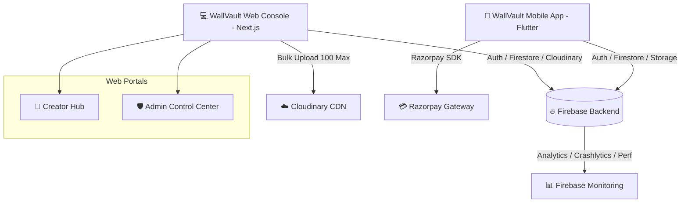

# 🎨 WallVault — Premium Wallpaper Marketplace & Creator Economy

<p align="center">
  
</p>

<p align="center">
  <strong>The Ultimate Ecosystem for Digital Artists, Wallpaper Enthusiasts, and Content Creators</strong>
</p>

<p align="center">
  <a href="#-architecture--tech-stack"></a>
  <a href="#-architecture--tech-stack"></a>
  <a href="#-architecture--tech-stack"></a>
  <a href="#-architecture--tech-stack"></a>
  <a href="#-architecture--tech-stack"></a>
</p>

---

## 📌 Executive Summary

**WallVault** is a full-stack, enterprise-grade wallpaper platform featuring a cross-platform mobile experience for iOS/Android and a high-performance web dashboard for Creators and Platform Administrators. Designed with modern CRED-inspired liquid glass aesthetics, WallVault empowers creators to monetize high-resolution wallpapers, track real-time analytics, bulk-upload collections, and manage earnings while delivering a smooth 60fps experience for end users.

> [!NOTE]
> **Key Highlight**: Built with custom **Liquid Glass UI**, 3D Parallax tilt onboarding, real-time Firebase telemetry (Analytics, Crashlytics, Performance Monitoring), Razorpay integration, and automated creator payout pipelines.

---

## 🚀 Ecosystem Overview



---

## ✨ Key Features & Capabilities

### 📱 1. Mobile App (Flutter)
- **Liquid Glass Categories**: Pill-shaped translucent glass filters with smooth glowing border states.
- **3D Parallax Onboarding**: 3-slide interactive tutorial featuring 3D phone tilt, staggered creator avatar pop-ins, coin rain, golden key-turn lock opening animation, and confetti bursts.
- **Creator Gamification**: Leveling, XP progress bars, daily streak counters, and reward metrics displayed exclusively for registered creators.
- **Dynamic Pricing Engine**: Creators set custom pricing for individual wallpapers (Free vs Premium INR pricing).
- **Interactive Glassmorphic Rating System**: Visual star ratings with dynamic verbal feedback labels ("Masterpiece!", "Stunning!").
- **Live Wallpaper Telemetry**: Firebase Performance Monitoring and Crashlytics pre-configured for automated runtime telemetry.
- **Seamless Downloads**: One-tap background asset saving, download counting, and offline preference caching.

### 🎨 2. Creator Hub Web Portal (Next.js)
- **Bulk Asset Uploading**: Process up to **100 wallpapers simultaneously** with Cloudinary direct integration, progress bars, and container cleanup.
- **Real-Time Analytics Dashboard**: Real Firebase data visualization including daily download counts, monthly revenue graphs (70/30 creator revenue split), category distribution pie charts, and date range filters (7d, 30d, All time).
- **Asset Management**: Edit wallpaper titles, categories, pricing mode (Free vs Premium), and replace preview images live.
- **Payout Management**: Request earnings withdrawals to UPI or Bank accounts with real-time status tracking.
- **Profile Synchronization**: Update creator avatar and display name across Web, App, and Admin consoles instantaneously.

### 🛡️ 3. Admin Control Center (Next.js)
- **Real-time Submission Moderation**: One-click approval/rejection queue for pending creator uploads with preview inspection.
- **Platform Analytics**: Live overview of total platform revenue, total downloads, registered creators, active users, and pending payouts.
- **Asset Control**: Search, filter, edit, or delete any wallpaper asset in the platform database.
- **Creator & User Directory**: View detailed user accounts, daily streak counts, subscription tiers, and creator payout credentials.

---

## 🛠️ Architecture & Tech Stack

### Mobile Client (`wallvault/`)
| Component | Tech Stack |
| :--- | :--- |
| **Framework** | Flutter 3.29+ / Dart 3.12+ |
| **State Management** | Flutter Riverpod 3.x (`flutter_riverpod`, `riverpod_annotation`) |
| **Routing** | GoRouter (`go_router`) |
| **Animations** | Flutter Animate (`flutter_animate`), Lottie (`lottie`), Custom Painters |
| **Backend & Auth** | Firebase Auth (Google Sign-In, Apple Sign-In), Firestore, Storage |
| **Monitoring** | Firebase Analytics, Crashlytics, Performance Monitoring |
| **Payments** | Razorpay Flutter (`razorpay_flutter`) |

### Web Portal (`wallvault-web/`)
| Component | Tech Stack |
| :--- | :--- |
| **Framework** | Next.js 16 (App Router), React 19, TypeScript |
| **Styling & Motion** | TailwindCSS v4, Vanilla CSS Glass Tokens (`globals.css`), Framer Motion 12 |
| **Data Visualization**| Recharts 3.x |
| **State & Forms** | Zustand, React Hook Form, Zod |
| **Icons & Design** | Lucide React, Glassmorphism, 21st.dev Dark Theme Tokens |
| **CDN & Storage** | Cloudinary Direct Upload API, Firebase Storage |

### Backend Services (`wallvault-backend/`)
| Component | Tech Stack |
| :--- | :--- |
| **Database** | Firebase Cloud Firestore |
| **Authentication** | Firebase Authentication |
| **Security Rules** | Declarative `firestore.rules` & `storage.rules` |

---

## 📂 Directory Structure

```
wallvalut/
├── README.md                   # 📖 Branded Project Documentation
├── wallvault/                  # 📱 Flutter Mobile Application
│   ├── android/                # Android native project files & Firebase plugins
│   ├── ios/                    # iOS native project files
│   ├── assets/                 # App assets (images, prebuilt onboarding wallpapers)
│   │   └── images/             # prebuilt_03.png, prebuilt_20.png, prebuilt_34.png
│   └── lib/
│       ├── core/               # Theme, constants, Liquid Glass UI utilities
│       ├── data/               # Repositories (Firestore queries, Auth)
│       ├── features/
│       │   ├── auth/           # Onboarding screen, Login, Auth providers
│       │   ├── home/           # Home screen, Category pills, Wallpaper detail
│       │   └── profile/        # User/Creator profile, Streaks, Leveling & XP
│       └── main.dart           # App entrypoint & Firebase initialization
│
├── wallvault-web/              # 💻 Next.js Creator Hub & Admin Portal
│   ├── src/
│   │   ├── app/
│   │   │   ├── (admin)/admin/  # Admin routes (Overview, Wallpapers, Creators, Users, Payouts)
│   │   │   ├── (creator)/creator/ # Creator routes (Dashboard, Bulk Upload, Analytics, Profile)
│   │   │   └── globals.css     # Glass design system tokens & animation keyframes
│   │   ├── components/         # Glass panels, Sidebar, KPICard, DataTable, AuthProvider
│   │   └── lib/                # Firebase Web SDK initialization
│   ├── package.json
│   └── tailwind.config.ts
│
└── wallvault-backend/          # 🔥 Firebase Configuration & Security Rules
    ├── firestore.rules         # Security rules for collections
    ├── storage.rules           # Security rules for cloud storage
    └── firebase.json           # Firebase project manifest
```

---

## ⚡ Prerequisites & Environment Setup

### Required Tools
- **Node.js**: `v20.x` or higher
- **npm**: `v10.x` or higher
- **Flutter SDK**: `v3.29.0` or higher
- **Java Development Kit (JDK)**: `JDK 17` (for Flutter Android builds)
- **Firebase CLI**: Installed globally via `npm install -g firebase-tools`

---

## ⚙️ Installation & Running Commands

### 1. Web Portal Setup (`wallvault-web`)

```bash
# Navigate to web application directory
cd wallvault-web

# Install dependencies
npm install

# Start development server
npm run dev

# Open browser at http://localhost:3000
```

#### Production Web Build
```bash
# Verify TypeScript types and build optimized production bundle
npm run build

# Start production server
npm run start
```

---

### 2. Mobile App Setup (`wallvault`)

```bash
# Navigate to Flutter application directory
cd wallvault

# Fetch dependencies
flutter pub get

# Clean build artifacts (recommended after configuration updates)
flutter clean

# Run on connected device or emulator
flutter run
```

#### Mobile APK Build (Android Debug/Release)
```bash
# Build Debug APK
flutter build apk --debug

# Build Release APK
flutter build apk --release
```

---

### 3. Firebase Rules & Deployment (`wallvault-backend`)

```bash
# Navigate to backend directory
cd wallvault-backend

# Login to Firebase
firebase login

# Deploy Security Rules to Firebase
firebase deploy --only firestore:rules,storage:rules
```

---

## 🔐 Database & Security Architecture

### Firestore Collections Schema

| Collection | Description | Access Policy |
| :--- | :--- | :--- |
| `users` | User profiles, creator status, levels, XP, streaks, payout details | Read: Authenticated / Write: Self or Admin |
| `wallpapers` | Uploaded wallpapers, price, status (`pending`, `approved`, `rejected`) | Read: Public (if approved) / Write: Creator or Admin |
| `payouts` | Withdrawal requests submitted by creators | Read: Creator/Admin / Write: Creator/Admin |
| `transactions` | Purchase logs and Razorpay transaction records | Read: User/Admin / Write: System/Admin |

---

## 📊 Analytics & Performance Setup

To verify Firebase Performance Monitoring & Crashlytics on Android:

```bash
cd wallvault
flutter build apk --debug
```

- **Screen Rendering Metrics**: Automatically captured via `firebase_performance`.
- **Network Request Tracing**: Monitored via HTTP interceptors.
- **Real-Time Crash Tracking**: Enabled via `firebase_crashlytics`.

---

## 📄 License & Attribution

Copyright © 2026 **WallVault Development Team**. All rights reserved.

---

<p align="center">
  Made with ❤️ by <strong>Masthan008</strong> & Team
</p>
