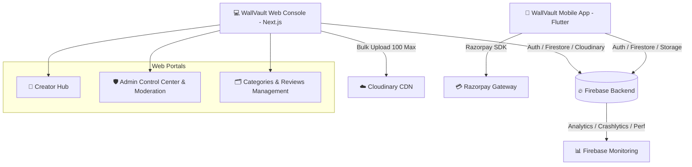

# 🎨 WallVault — Premium Wallpaper Marketplace & Creator Economy

<p align="center">
  
</p>

<p align="center">
  <strong>The Ultimate Ecosystem for Digital Artists, Wallpaper Enthusiasts, and Content Creators</strong>
</p>

<p align="center">
  <a href="#-architecture--tech-stack"></a>
  <a href="#-architecture--tech-stack"></a>
  <a href="#-architecture--tech-stack"></a>
  <a href="#-architecture--tech-stack"></a>
  <a href="#-architecture--tech-stack"></a>
</p>

---

## 📌 Executive Summary

**WallVault** is a full-stack, enterprise-grade wallpaper platform featuring a cross-platform mobile experience for iOS/Android and a high-performance web dashboard for Creators and Platform Administrators. Designed with modern CRED-inspired liquid glass aesthetics, WallVault empowers creators to monetize high-resolution wallpapers, track real-time analytics, bulk-upload collections, manage reviews, and customize categories while delivering a smooth 120fps experience for end users.

> [!NOTE]
> **Key Highlight**: Built with custom **Liquid Glass UI**, `nav_bar: ^0.1.1` liquid navigation engine, live phone OS mockup previewer, real-time reviews & nested replies, 3D Parallax tilt onboarding, real-time Firebase telemetry (Analytics, Crashlytics, Performance Monitoring), Razorpay integration, and automated creator payout pipelines.

---

## 🚀 Ecosystem Overview


```mermaid
graph TD
    A[📱 WallVault Mobile App - Flutter] -->|Auth / Firestore / Storage| C[(🔥 Firebase Backend)]
    B[💻 WallVault Web Console - Next.js] -->|Auth / Firestore / Cloudinary| C
    B -->|Bulk Upload 100 Max| D[☁️ Cloudinary CDN]
    A -->|Razorpay SDK| E[💳 Razorpay Gateway]
    C -->|Analytics / Crashlytics / Perf| F[📊 Firebase Monitoring]
    
    subgraph Web Portals
        B1[🎨 Creator Hub]
        B2[🛡️ Admin Control Center & Moderation]
        B3[🗂️ Categories & Reviews Management]
    end
    B --> B1
    B --> B2
    B --> B3
```

---

## ✨ Key Features & Capabilities

### 📱 1. Mobile App (Flutter)
- **🚀 Futuristic `nav_bar: ^0.1.1` Liquid Navigation Engine**: Skia/Impeller low-level rendering with liquid ripple physics, neon glow accents, magnetic icon animations, and fluid transitions.
- **📲 Live Phone OS Mockup & Preview Engine**: Real wallpaper preview inside phone screen frames. Features an interactive **Live Mockup Preview** overlay simulating:
  - **Lock Screen**: Real status bar, date banner, `09:41` lock clock, torch/camera quick buttons over the wallpaper.
  - **Home Screen**: Status bar, 4x2 app launcher icon grid, and glassmorphic bottom dock.
- **👤 Public Creator Profile Screen**: Tapping on any creator avatar opens their public creator card displaying total wallpapers count, combined downloads, active category badges, public bio, verification badge, and public wallpapers grid (**Zero private details exposed**).
- **💬 Real-Time Reviews, Ratings & Nested Replies**: 5-star interactive rating system, written reviews, and threaded/nested replies synced in real time via Firestore streams.
- **🔥 Dynamic Trending Feed**: Backend query featuring top downloaded wallpapers (`orderBy('downloads', descending: true)`).
- **Liquid Glass Categories**: Pill-shaped translucent glass filters with real-time Firestore category sync.
- **3D Parallax Onboarding**: Interactive tutorial featuring 3D phone tilt, creator avatar pop-ins, coin rain, golden key-turn lock opening animation, and confetti bursts.
- **Creator Gamification**: Leveling, XP progress bars, daily streak counters, and reward metrics displayed exclusively for registered creators.

### 🎨 2. Creator Hub Web Portal (Next.js)
- **⚙️ Public/Private Profile Controls**: Toggle settings allowing creators to enable/disable public profile visibility and show/hide bio text in the mobile application.
- **Bulk Asset Uploading**: Process up to **100 wallpapers simultaneously** with Cloudinary direct integration, progress bars, and automatic container cleanup upon completion.
- **Real-Time Analytics Dashboard**: Real Firebase data visualization including daily download counts, monthly revenue graphs (70/30 creator revenue split), category distribution pie charts, and date range filters (7d, 30d, All time).
- **Asset Management**: Edit wallpaper titles, categories, pricing mode (Free vs Premium), and replace preview images live.
- **Payout Management**: Request earnings withdrawals to UPI or Bank accounts with real-time status tracking.

### 🛡️ 3. Admin Control Center & Moderation (Next.js)
- **🗂️ Category & Sub-Category Management (`/admin/categories`)**: Create new categories (Name, Description, Color Accent, Sub-Categories) and add sub-categories (e.g. `Arabic Qalb` → `Calligraphy`; `Anime` → `Cyberpunk Anime`).
  - **Real-Time App Sync**: Additions and deletions automatically update the Mobile App (`home_screen.dart`) and Creator Hub in real time.
- **💬 Review & Comment Moderation (`/admin/reviews`)**: Monitor all platform reviews and comments in real time with search filters. Admins can delete misbehaving reviews, which immediately removes them from the platform and mobile app.
- **Submission Moderation Queue**: One-click approval/rejection queue for pending creator uploads with preview inspection.
- **Platform Analytics**: Live overview of total platform revenue, total downloads, registered creators, active users, and pending payouts.
- **Creator & User Directory**: View detailed user accounts, daily streak counts, subscription tiers, and creator payout credentials.

---

## 🛠️ Architecture & Tech Stack

### Mobile Client (`wallvault/`)
| Component | Tech Stack |
| :--- | :--- |
| **Framework** | Flutter 3.29+ / Dart 3.12+ |
| **Navigation Engine** | `nav_bar: ^0.1.1` (Liquid Physics, Magnetic Animations) |
| **State Management** | Flutter Riverpod 3.x (`flutter_riverpod`, `riverpod_annotation`) |
| **Routing** | GoRouter (`go_router`) |
| **Animations** | Flutter Animate (`flutter_animate`), Lottie (`lottie`), Custom Painters |
| **Backend & Auth** | Firebase Auth (Google Sign-In, Apple Sign-In), Firestore, Storage |
| **Monitoring** | Firebase Analytics, Crashlytics, Performance Monitoring |
| **Payments** | Razorpay Flutter (`razorpay_flutter`) |

### Web Portal (`wallvault-web/`)
| Component | Tech Stack |
| :--- | :--- |
| **Framework** | Next.js 16 (App Router), React 19, TypeScript |
| **Styling & Motion** | TailwindCSS v4, Vanilla CSS Glass Tokens (`globals.css`), Framer Motion 12 |
| **Data Visualization**| Recharts 3.x |
| **State & Forms** | Zustand, React Hook Form, Zod |
| **Icons & Design** | Lucide React, Glassmorphism, 21st.dev Dark Theme Tokens |
| **CDN & Storage** | Cloudinary Direct Upload API, Firebase Storage |

### Backend Services (`wallvault-backend/`)
| Component | Tech Stack |
| :--- | :--- |
| **Database** | Firebase Cloud Firestore |
| **Authentication** | Firebase Authentication |
| **Security Rules & Indexes** | Declarative `firestore.rules` & `firestore.indexes.json` |

---

## 📂 Directory Structure

```
wallvalut/
├── README.md                   # 📖 Branded Project Documentation
├── wallvault/                  # 📱 Flutter Mobile Application
│   ├── android/                # Android native project files & Firebase plugins
│   ├── ios/                    # iOS native project files
│   ├── assets/                 # App assets (images, prebuilt onboarding wallpapers)
│   └── lib/
│       ├── core/               # Theme, constants, Liquid Glass UI utilities, main_shell
│       ├── data/               # Repositories (Firestore queries, Reviews, Auth)
│       ├── features/
│       │   ├── auth/           # Onboarding screen, Login, Auth providers
│       │   ├── creator/        # Public Creator Profile screen & stats
│       │   ├── home/           # Home screen, Trending tab, Wallpaper detail, Live Mockup Apply Sheet
│       │   └── profile/        # User/Creator profile, Streaks, Leveling & XP, Settings
│       └── main.dart           # App entrypoint & Firebase initialization
│
├── wallvault-web/              # 💻 Next.js Creator Hub & Admin Portal
│   ├── src/
│   │   ├── app/
│   │   │   ├── (admin)/admin/  # Admin routes (Overview, Wallpapers, Categories, Reviews, Creators, Users, Payouts)
│   │   │   ├── (creator)/creator/ # Creator routes (Dashboard, Bulk Upload, Analytics, Profile Settings)
│   │   │   └── globals.css     # Glass design system tokens & animation keyframes
│   │   ├── components/         # Glass panels, Sidebar, KPICard, DataTable, AuthProvider
│   │   └── lib/                # Firebase Web SDK initialization & useCategories hook
│   ├── package.json
│   └── tailwind.config.ts
│
└── wallvault-backend/          # 🔥 Firebase Configuration & Security Rules
    ├── firestore.rules         # Security rules for collections (categories, reviews, wallpapers, users)
    ├── firestore.indexes.json  # Composite indexes for trending & review queries
    ├── storage.rules           # Security rules for cloud storage
    └── firebase.json           # Firebase project manifest
```

---

## ⚡ Prerequisites & Environment Setup

### Required Tools
- **Node.js**: `v20.x` or higher
- **npm**: `v10.x` or higher
- **Flutter SDK**: `v3.29.0` or higher
- **Java Development Kit (JDK)**: `JDK 17` (for Flutter Android builds)
- **Firebase CLI**: Installed globally via `npm install -g firebase-tools`

---

## ⚙️ Installation & Running Commands

### 1. Web Portal Setup (`wallvault-web`)

```bash
# Navigate to web application directory
cd wallvault-web

# Install dependencies
npm install

# Start development server
npm run dev

# Open browser at http://localhost:3000
```

---

### 2. Mobile App Setup (`wallvault`)

```bash
# Navigate to Flutter application directory
cd wallvault

# Fetch dependencies
flutter pub get

# Clean build artifacts
flutter clean

# Run on connected device or emulator
flutter run
```

#### Mobile APK Build (Android Debug/Release)
```bash
# Build Debug APK
flutter build apk --debug

# Build Release APK
flutter build apk --release
```

---

### 3. Firebase Rules & Deployment (`wallvault-backend`)

```bash
# Navigate to backend directory
cd wallvault-backend

# Login to Firebase
firebase login

# Deploy Security Rules & Composite Indexes to Firebase
firebase deploy --only firestore:rules,firestore:indexes
```

---

## 🔐 Database & Security Architecture

### Firestore Collections Schema

| Collection | Description | Access Policy |
| :--- | :--- | :--- |
| `users` | User profiles, creator status, levels, XP, streaks, bio, visibility settings | Read: Public/Authenticated / Write: Self or Admin |
| `wallpapers` | Uploaded wallpapers, price, downloads, rating, status (`approved`, `pending`) | Read: Public / Write: Creator or Admin |
| `categories` | Main categories & sub-categories lists with color accents | Read: Public / Write: Authenticated Users/Admin |
| `reviews` | Wallpaper reviews, 5-star ratings, and nested replies | Read: Public / Write: Authenticated / Delete: Owner/Admin |
| `payouts` | Withdrawal requests submitted by creators | Read: Creator/Admin / Write: Creator/Admin |
| `transactions` | Purchase logs and Razorpay transaction records | Read: User/Admin / Write: System/Admin |

---

## 📄 License & Attribution

Copyright © 2026 **WallVault Development Team**. All rights reserved.

---

<p align="center">
  Made with ❤️ by <strong>Masthan008</strong> & Team
</p>
